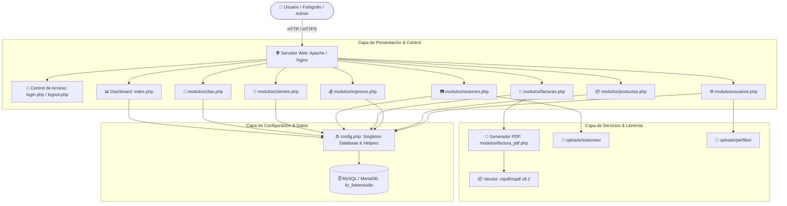
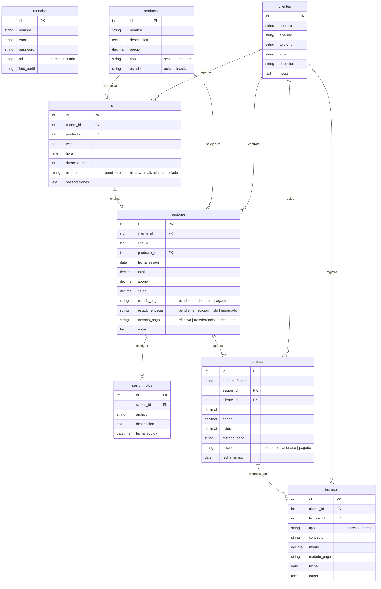
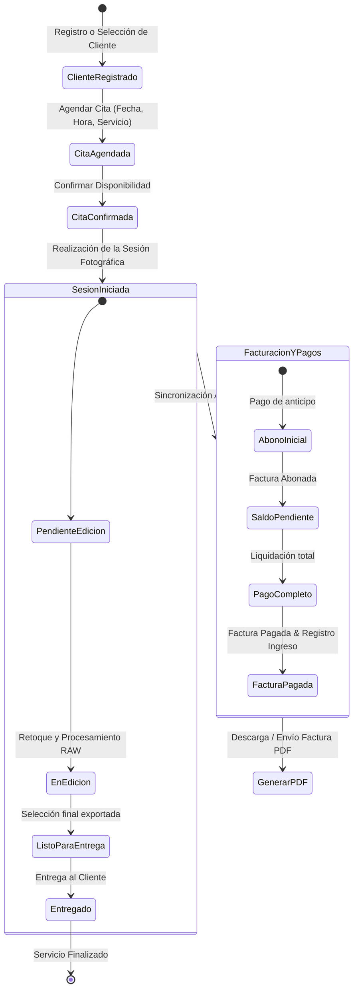

# 📸 Lizdy Pineda Fotoestudio – Sistema Web de Gestión

> [!abstract] Resumen Ejecutivo
> Sistema web integral de gestión administrativa, comercial y operativa desarrollado a la medida para **Lizdy Pineda Fotoestudio**. Centraliza el control de clientes (CRM), programación de citas, seguimiento del flujo de trabajo de sesiones fotográficas, galería de fotos, facturación con exportación PDF, control financiero (ingresos y egresos) y administración de usuarios con control de acceso basado en roles (RBAC).

---

## 📑 Tabla de Contenido
- [📸 Lizdy Pineda Fotoestudio – Sistema Web de Gestión](#-lizdy-pineda-fotoestudio--sistema-web-de-gestión)
  - [📑 Tabla de Contenido](#-tabla-de-contenido)
  - [✨ Características Principales](#-características-principales)
  - [🏗️ Arquitectura del Sistema](#️-arquitectura-del-sistema)
  - [🗄️ Modelo de Base de Datos](#️-modelo-de-base-de-datos)
    - [Diagrama Entidad-Relación (ERD)](#diagrama-entidad-relación-erd)
    - [Diccionario de Datos](#diccionario-de-datos)
  - [🔄 Flujo Operativo del Negocio](#-flujo-operativo-del-negocio)
  - [🧩 Módulos del Sistema](#-módulos-del-sistema)
    - [1. Dashboard Central (`index.php`)](#1-dashboard-central-indexphp)
    - [2. Módulo de Citas (`modulos/citas.php`)](#2-módulo-de-citas-moduloscitasphp)
    - [3. Módulo de Clientes (`modulos/clientes.php`)](#3-módulo-de-clientes-modulosclientesphp)
    - [4. Módulo de Sesiones Fotográficas y Galería (`modulos/sesiones.php`)](#4-módulo-de-sesiones-fotográficas-y-galería-modulossesionesphp)
    - [5. Módulo de Facturación y PDF (`modulos/facturas.php` \& `modulos/factura_pdf.php`)](#5-módulo-de-facturación-y-pdf-modulosfacturasphp--modulosfactura_pdfphp)
    - [6. Módulo Financiero: Ingresos y Egresos (`modulos/ingresos.php`)](#6-módulo-financiero-ingresos-y-egresos-modulosingresosphp)
    - [7. Catálogo de Servicios / Productos (`modulos/productos.php`)](#7-catálogo-de-servicios--productos-modulosproductosphp)
    - [8. Módulo de Usuarios y Seguridad (`modulos/usuarios.php` \& `login.php`)](#8-módulo-de-usuarios-y-seguridad-modulosusuariosphp--loginphp)
  - [📂 Estructura del Repositorio](#-estructura-del-repositorio)
  - [🚀 Guía de Instalación y Despliegue](#-guía-de-instalación-y-despliegue)
    - [Requisitos Previos](#requisitos-previos)
    - [Paso 1: Clonar o ubicar el proyecto](#paso-1-clonar-o-ubicar-el-proyecto)
    - [Paso 2: Instalación de dependencias (Composer)](#paso-2-instalación-de-dependencias-composer)
    - [Paso 3: Configurar la Base de Datos](#paso-3-configurar-la-base-de-datos)
    - [Paso 4: Variables de Configuración (`config.php`)](#paso-4-variables-de-configuración-configphp)
    - [Paso 5: Permisos de Directorios de Subida](#paso-5-permisos-de-directorios-de-subida)
  - [🔐 Seguridad y Roles](#-seguridad-y-roles)
  - [🎨 Sistema de Diseño (UI/UX)](#-sistema-de-diseño-uiux)
  - [📌 Enlaces de Obsidian Relacionados](#-enlaces-de-obsidian-relacionados)

---

## ✨ Características Principales

- **Panel de Control (Dashboard) en Tiempo Real**: Estadísticas instantáneas de clientes, citas del mes, ingresos acumulados, cuentas por cobrar y alertas inteligentes de sesiones pendientes de entrega y cobro.
- **Gestión de Agenda y Citas**: Calendario y listado de citas con duraciones estimadas, vinculación de cliente y tipo de servicio, control de estados (pendiente, confirmada, realizada, cancelada).
- **Directorio de Clientes (CRM)**: Ficha de contacto de cada cliente con historial automático de citas, sesiones contratadas y facturación asociada.
- **Ciclo de Vida de Sesiones Fotográficas**: Seguimiento paso a paso del estado de entrega (`pendiente` ➔ `en edición` ➔ `listo` ➔ `entregado`) y estado de pago (`pendiente` ➔ `abonado` ➔ `pagado`).
- **Galería de Muestras y Archivos**: Carga de fotografías por sesión fotográfica con almacenamiento estructurado y visualización rápida vía AJAX/JSON.
- **Facturación Automatizada & Generación de PDF**: Emisión de facturas comerciales vinculadas a sesiones fotográficas, soporte para abonos parciales y exportación en PDF de alta fidelidad mediante **mPDF**.
- **Contabilidad e Inteligencia Financiera**: Registro detallado de ingresos y egresos, balance neto mensual y anual con gráficos estadísticos comparativos.
- **Seguridad por Roles (RBAC)**: Distinción entre perfil `admin` (acceso irrestricto, finanzas, gestión de usuarios) y perfil `usuario` (operatividad diaria de citas, sesiones y clientes).

---

## 🏗️ Arquitectura del Sistema

El sistema implementa una arquitectura basada en **PHP modular con capa de abstracción de datos singleton**:



---

## 🗄️ Modelo de Base de Datos

### Diagrama Entidad-Relación (ERD)



### Diccionario de Datos

| Tabla | Propósito | Llaves Foráneas |
| :--- | :--- | :--- |
| `usuarios` | Cuentas de administradores y fotógrafos con hash bcrypt. | — |
| `clientes` | Libreta de clientes y prospectos del estudio fotográfico. | — |
| `productos` | Catálogo de paquetes de sesiones fotográficas y productos físicos. | — |
| `citas` | Agenda de reservaciones en el estudio o locaciones externas. | `cliente_id` ➔ `clientes.id`<br>`producto_id` ➔ `productos.id` |
| `sesiones` | Trabajo fotográfico central con seguimiento de estados de producción y pagos. | `cliente_id` ➔ `clientes.id`<br>`cita_id` ➔ `citas.id`<br>`producto_id` ➔ `productos.id` |
| `sesion_fotos` | Registro de fotografías y material entregable subido a cada sesión. | `sesion_id` ➔ `sesiones.id` |
| `facturas` | Documentos contables y comprobantes de venta emitidos. | `sesion_id` ➔ `sesiones.id`<br>`cliente_id` ➔ `clientes.id` |
| `ingresos` | Libro contable de entradas (pagos de clientes) y salidas (gastos de operación). | `cliente_id` ➔ `clientes.id`<br>`factura_id` ➔ `facturas.id` |

---

## 🔄 Flujo Operativo del Negocio



---

## 🧩 Módulos del Sistema

### 1. Dashboard Central (`index.php`)
- **Indicadores Clave (KPIs)**:
  - Total de Clientes registrados en el sistema.
  - Citas programadas en el mes en curso.
  - Sesiones pendientes de entrega física/digital.
  - Sesiones pendientes de pago y saldo total por cobrar.
  - Ingresos totales acumulados en el mes y año en curso.
- **Muro de Alertas Proactivas**:
  - Alertas de cobro (clientes con saldo adeudado más próximos a la fecha de sesión).
  - Alertas de entrega (sesiones finalizadas que esperan entrega al cliente).
  - Alertas de citas para el día siguiente (recordatorios preventivos).
- **Gráfica de Tendencia Financiera**: Visualización de los últimos 7 meses de ingresos.

### 2. Módulo de Citas (`modulos/citas.php`)
- Agendamiento rápido con cliente, servicio/producto, fecha, hora y duración en minutos.
- Filtros dinámicos por rango de fechas y estado (`pendiente`, `confirmada`, `realizada`, `cancelada`).
- Cambio ágil de estados con un solo clic.

### 3. Módulo de Clientes (`modulos/clientes.php`)
- Creación, edición y eliminación de clientes con validación.
- Búsqueda en tiempo real por nombre, apellido, teléfono o email.
- Paginación server-side.
- Consulta instantánea de cantidad total de citas históricas y fecha de su última sesión.

### 4. Módulo de Sesiones Fotográficas y Galería (`modulos/sesiones.php`)
- Gestión central de la producción fotográfica:
  - Asignación de servicios múltiples y paquete principal.
  - Estados de entrega: `pendiente`, `en edición`, `listo`, `entregado`.
  - Estados de pago: `pendiente`, `abonado`, `pagado`.
  - Cálculo dinámico de saldo pendiente (`total - abono`).
- **Sincronización Automática de Factura**: Al modificar montos o abonos en la sesión, la factura vinculada se recalcula en tiempo real.
- **Registro Automático de Ingreso**: Si una sesión cambia a estado `pagado`, el sistema liquida y asienta el movimiento en el libro de ingresos.
- **Galería Integrada**: Carga de fotos de la sesión con endpoint JSON (`?accion_galeria=1&sesion_id=ID`).

### 5. Módulo de Facturación y PDF (`modulos/facturas.php` & `modulos/factura_pdf.php`)
- Numeración correlativa y trazabilidad por año y cliente.
- Desglose detallado de valores totales, abonos recibidos, saldo adeudado y método de pago.
- Generación de PDF profesional con **mPDF**:
  - Encabezado con logotipo del estudio (`uploads/logo.jpg`).
  - Datos completos de contacto del estudio y del cliente.
  - Historial de recibos/abonos con fechas y métodos de pago.
  - Formato adaptable listo para impresión o envío digital.

### 6. Módulo Financiero: Ingresos y Egresos (`modulos/ingresos.php`)
> [!caution] Acceso Restringido
> Este módulo requiere permisos de **Administrador** (`$_SESSION['usuario_rol'] === 'admin'`). Los usuarios estándar son rechazados con una pantalla decorativa de acceso restringido (HTTP 403).

- Registro de ingresos por ventas y egresos por costos operativos (equipo, transporte, alquiler de locaciones, etc.).
- Filtros por mes y año.
- Balance neto (Ingresos vs. Egresos) y gráficos de barras por mes y día.

### 7. Catálogo de Servicios / Productos (`modulos/productos.php`)
- Configuración de tarifas estándar (ej: Fotografía de Bodas, Quinceañeras, Sesión Estudio, Retratos, Impresiones, Photobooks).
- Activación o desactivación rápida mediante toggle (`activo` / `inactivo`).

### 8. Módulo de Usuarios y Seguridad (`modulos/usuarios.php` & `login.php`)
- Control de usuarios con roles:
  - **Administrador (`admin`)**: Acceso a estadísticas financieras, reportes, usuarios y configuración.
  - **Usuario Estándar (`usuario`)**: Operador de citas, sesiones y clientes.
- Carga de fotografía de perfil personalizada (`uploads/perfiles/`).
- Cifrado de contraseñas con función nativa de PHP `password_hash($pass, PASSWORD_DEFAULT)` y verificación con `password_verify()`.

---

## 📂 Estructura del Repositorio

```text
liz-fotoestudio/
│
├── README.md                      # Documentación completa del proyecto (este archivo)
├── config.php                     # Conexión MySQL, constantes, helpers y sesiones
├── index.php                      # Dashboard principal con estadísticas y alertas
├── login.php                      # Pantalla y lógica de autenticación
├── logout.php                     # Cierre y destrucción de sesión
├── actualizar_roles.sql           # Script de migración de roles para la BD
├── composer.json                  # Definición de dependencias de PHP (mPDF)
├── composer.lock                  # Bloqueo de versiones instaladas de Composer
│
├── includes/                      # Componentes transversales
│   └── sidebar.php                # Barra lateral de navegación con insignias de alerta
│
├── modulos/                       # Controladores y vistas por funcionalidad
│   ├── citas.php                  # Gestión de citas y calendario
│   ├── clientes.php               # Directorio y gestión de clientes (CRM)
│   ├── factura_pdf.php            # Renderizador y exportador de facturas a PDF
│   ├── facturas.php               # Listado y control de facturas
│   ├── ingresos.php               # Finanzas, caja menor, ingresos y egresos (Admin)
│   ├── productos.php              # Catálogo de servicios y precios
│   ├── sesiones.php               # Flujo operativo de sesiones y fotos
│   ├── sidebar.php                # Plantilla auxiliar de navegación
│   └── usuarios.php               # Gestión de usuarios del sistema (Admin)
│
├── uploads/                       # Archivos multimedia subidos por los usuarios
│   ├── logo.jpg                   # Logotipo oficial del estudio
│   ├── perfiles/                  # Avatares de usuarios del sistema
│   └── sesiones/                  # Fotografías y muestras de sesiones
│
└── vendor/                        # Paquetes de Composer
    ├── autoload.php               # Cargador automático PSR-4
    ├── composer/                  # Metadata de Composer
    └── mpdf/                      # Librería de generación de PDF mPDF v8.2
```

---

## 🚀 Guía de Instalación y Despliegue

### Requisitos Previos
- **Servidor Web**: Apache (con `mod_rewrite` habilitado) o Nginx.
- **PHP**: Versión 8.0 o superior (extensiones requeridas: `php-mysqli`, `php-gd`, `php-mbstring`, `php-xml`).
- **Base de Datos**: MySQL 5.7+ o MariaDB 10.3+.
- **Gestor de paquetes**: Composer 2.x.

### Paso 1: Clonar o ubicar el proyecto
Colocar el directorio `liz-fotoestudio` dentro de la carpeta pública del servidor web (por ejemplo, `C:/xampp/htdocs/liz-fotoestudio` en XAMPP o `/var/www/html/liz-fotoestudio` en Linux).

### Paso 2: Instalación de dependencias (Composer)
Si la carpeta `vendor/` no está presente o requiere actualización, ejecute en la terminal dentro de `liz-fotoestudio`:
```bash
composer install --no-dev --optimize-autoloader
```

### Paso 3: Configurar la Base de Datos
1. Acceda a su motor MySQL / phpMyAdmin.
2. Cree la base de datos `liz_fotoestudio`:
   ```sql
   CREATE DATABASE liz_fotoestudio CHARACTER SET utf8mb4 COLLATE utf8mb4_unicode_ci;
   ```
3. Ejecute las sentencias de creación de tablas o aplique la migración de roles:
   ```sql
   -- Aplicar migración de roles
   ALTER TABLE usuarios 
   ADD COLUMN IF NOT EXISTS rol ENUM('admin','usuario') DEFAULT 'usuario' AFTER password;

   UPDATE usuarios SET rol = 'admin' WHERE email = 'admin@lizfotoestudio.com';
   ```

### Paso 4: Variables de Configuración (`config.php`)
Edite el archivo `config.php` con los parámetros correspondientes a su entorno:

```php
define('DB_HOST', 'localhost');
define('DB_USER', 'liz_user');               // Su usuario de base de datos
define('DB_PASS', 'LizFoto2026_Secure!');    // Su contraseña de base de datos
define('DB_NAME', 'liz_fotoestudio');
define('SITE_URL', 'http://localhost/liz-fotoestudio'); // O IP del servidor
define('SITE_NAME', 'Lizdy Pineda Fotoestudio');
```

### Paso 5: Permisos de Directorios de Subida
Asegúrese de que el servidor web tenga permisos de escritura en la carpeta de subidas:
```bash
# En entornos Linux / Apache:
chmod -R 775 uploads/
chown -R www-data:www-data uploads/
```

---

## 🔐 Seguridad y Roles

> [!tip] Buenas Prácticas Implementadas
> - **Autenticación con Password Hashing**: Se emplea el algoritmo estándar `bcrypt` gestionado por `password_hash()` y `password_verify()`.
> - **Consultas Preparadas**: Todas las consultas con parámetros del usuario utilizan `mysqli::prepare()` con enlace tipado de parámetros para prevenir **Inyecciones SQL (SQLi)**.
> - **Sanitización de Salidas**: La función auxiliar `sanitize()` aplica `htmlspecialchars(..., ENT_QUOTES, 'UTF-8')` mitigando vulnerabilidades de **Cross-Site Scripting (XSS)**.
> - **Control de Sesiones Seguro**: Verificación estricta de variables de sesión (`$_SESSION['usuario_id']`) y redirección inmediata en rutas no autenticadas con `requerirLogin()`.
> - **Validación de Roles (RBAC)**: Bloqueo de endpoints sensibles a través de `requerirAdmin()` y `esAdmin()`.

---

## 🎨 Sistema de Diseño (UI/UX)

La interfaz gráfica cuenta con un diseño artesanal desarrollado con tokens CSS personalizados, reflejando una estética fotográfica cálida, elegante y profesional:

```css
:root {
  --bg:         #faf8f6;       /* Fondo neutro marfil */
  --surface:    #ffffff;       /* Superficie de tarjetas */
  --navy:       #1a1f3c;       /* Azul marino profundo para texto principal */
  --rose:       #e8789a;       /* Rosa de acento para botones y destaques */
  --rose-light: #f5b8ce;       /* Rosa pastel */
  --rose-pale:  #fce8f0;       /* Rosa pálido para fondos secundarios */
  --rose-deep:  #c4547a;       /* Rosa oscuro para gradientes y hover */
  --teal:       #5bbcb8;       /* Turquesa para estados de éxito */
  --teal-light: #9ddbd8;       /* Turquesa pastel */
  --text:       #2a2040;       /* Tipografía estándar */
  --text-mid:   #6b5e7a;       /* Texto secundario */
  --text-dim:   #a899b5;       /* Etiquetas y placeholders */
  --border:     #ede0ea;       /* Bordes sutiles */
}
```

- **Tipografías**: 
  - *Dancing Script* (Google Fonts): Utilizada para títulos y logotipo de marca.
  - *Nunito* (Google Fonts): Tipografía principal para legibilidad de datos, tablas y formularios.

---

## 📌 Enlaces de Obsidian Relacionados

- [[../README|🏠 Índice Principal de Proyectos]]
- [[../Bienvenido|ℹ️ Nota de Bienvenida del Vault]]
- Categorías: `#proyecto` | `#php` | `#mysql` | `#fotografia` | `#crm`
